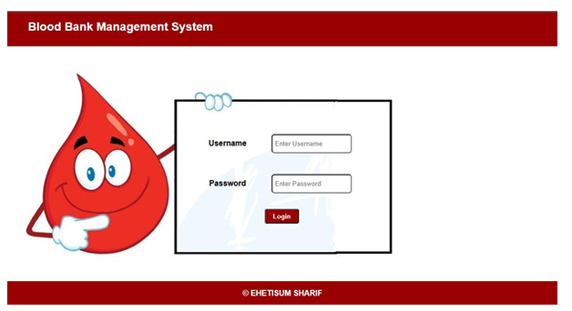
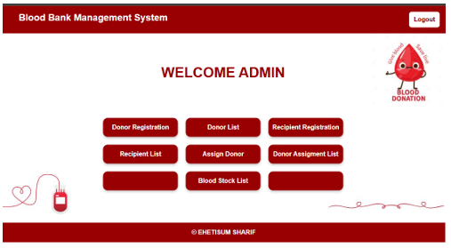
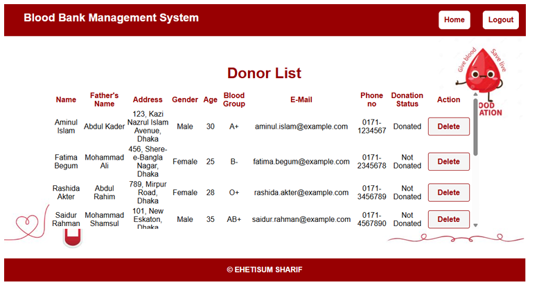
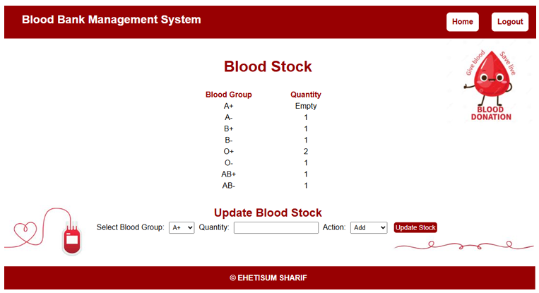

<div align="center">

  <h1>🩸 Blood Bank Management System (BBMS)</h1>
  <p><b>A web-based platform designed to manage blood donations, donors, recipients, and blood inventory efficiently.</b></p>

  <!-- Badges -->
  
  
  

</div>

---

## 📌 About The Project
The **Blood Bank Management System (BBMS)** is developed as a Database Management System Lab project under the Department of Computer Science and Engineering at **IUBAT**. The primary goal of this platform is to use modern database technologies to efficiently handle blood donations, track real-time blood stock levels, manage donor/recipient registrations, and process emergency blood requests.

---

## ✨ Key Features & Functionalities
- **Admin Authentication:** Secure login system for administrators using PHP sessions and database verification.
- **Donor Management:** Register new donors, view the complete donor list, track their donation status, and manage records.
- **Recipient Management:** Register individuals in need of blood, track medical problem details, required units, and view recipient lists.
- **Blood Stock Management:** Real-time tracking and updating of blood inventory based on donations, assignments, and stock modifications.
- **Donor-Recipient Assignment:** Assign compatible donors to recipients with blood group matching validation, and handle status updates (Pending, Completed, Canceled).

---

## 🛠️ Tech Stack
- **Frontend:** HTML5, CSS3
- **Backend:** PHP (using PHP Data Objects - PDO for secure database connection)
- **Database:** MySQL 
- **Server:** XAMPP 

---

## 🗄️ Database Schema (`bbms`)
The relational database consists of the following key tables:
1. **`admin`**: Stores administrator login credentials (`id`, `u_name`, `password`).
2. **`blood_stock`**: Tracks available blood groups and quantities (`id`, `bgroup`, `quantity`).
3. **`donor_registration`**: Stores personal and contact details of donors.
4. **`recipent_registration`**: Stores patient requirements, blood group, units needed, and location details.
5. **`donor_recipient_assignment`**: Manages the mapping between donors and recipients, quantities, and assignment status (`pending`, `completed`, `canceled`).

---

## 📸 Screenshots

<div align="center">

  <h3>Admin Login Page</h3>
  

  <h3>Admin Dashboard</h3>
  

  <h3>Donor List</h3>
  

  <h3>Blood Stock</h3>
  

</div>

---

## 🚀 Getting Started

To run this project locally, follow these steps:

### Prerequisites
- Install **XAMPP** (or any local server supporting Apache and MySQL/MariaDB).
- Git installed on your system.

### Installation & Setup

1. **Clone the repository:**
   ```bash
   git clone [https://github.com/EhetisumSharif/BBMS.git](https://github.com/EhetisumSharif/BBMS.git)
